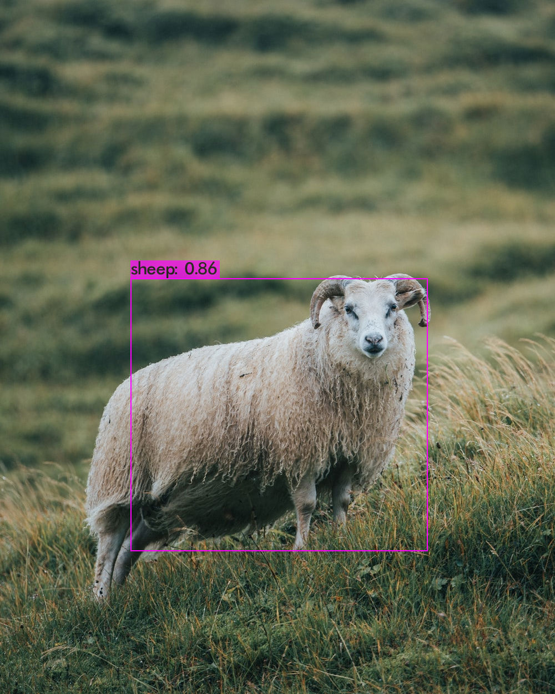

## Yolov4 Tiny Sheep Detection

#### 1 - run coco_sheep.py =>  selected sheep subset(450 images) of COCO dataset. https://cocodataset.org/#home

#### 2 - to download darknet to apply yolov4 tiny => https://github.com/AlexeyAB/darknet

#### 3 - video_detector.py and photo_detector.py => run to detects on video and image

#### !!! to build fast I used tiny version of YOLOv4. However, if we use yolov4 and download more images -
#### our model has will greater accuracy.

